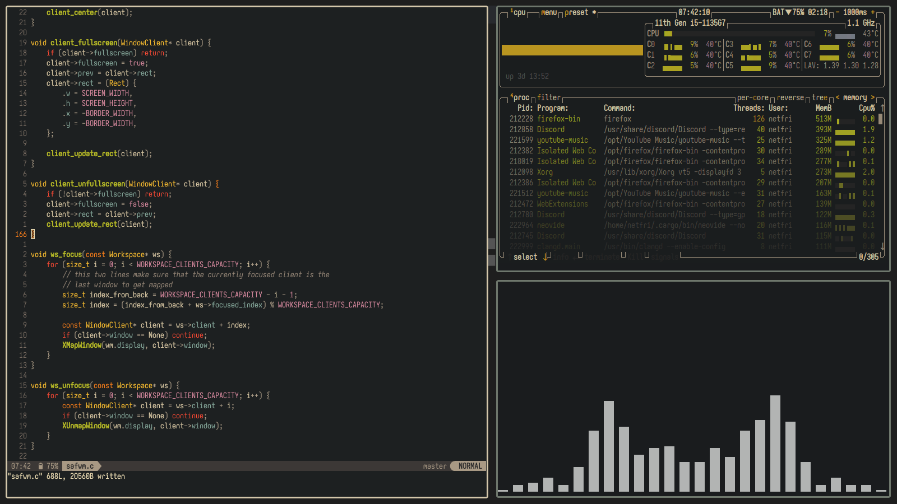
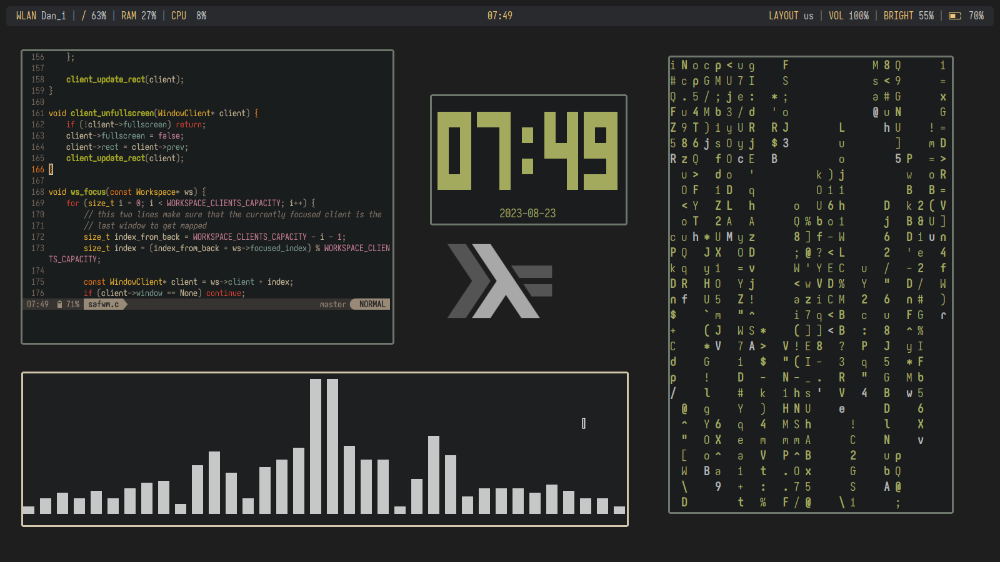

# safwm
a Simple and Adequate Floating Window Manager




## But why another window manager?
I'm a man of simplicity.
I used many window managers for a really long time (about a week) and I've came to the realization of what is the best window manager that can be created (imo ofc).\
It's important to know that I can't please everyone, so a "must be" thing is source code readability and ease of modification - meaning that everyone who wants to can modify/add/remove from the source code without any problem.

## TLDR
simplicity.

### There are some window managers that almost met my expectancies:
* [Ragnar](https://github.com/cococry/Ragnar) - The first ever window manager that I've used. truly an amazing piece of software, but the source was hard to modify, although it was easy to understand.
* [sowm](https://github.com/dylanaraps/sowm) - Really amazing window manager. most of my source code is inspired (stolen) from it. the only problem I had is variable naming (hard to understand the difference between `client.f` and `client.fs` - which one is focus? which one is fullscreen? both words contain `f` and `s`...) and weird control flow (it took me about an hour to understand `for win if`, until I figured out that `win` is actually a macro).\
  sowm also killed windows instead of properly closing them, and it also windows became invisible when trying to do a screenshot and I couldn't figure out why (this is the thing that made me decide on starting to write my own window manager).
* [dwm](https://dwm.suckless.org/) - the first minimal window manager I've encountered (but not the first one I've settled on using), but the source code was just... weird? and I was too lazy to actually understand how it works.
* [xmonad](https://xmonad.org/) - I'm in love Haskell for about a year and a half already, but XMonad made the installation process and configuration a lot more complicated than it should be :(

## Installation
```shell
$ git clone https://github.com/netfri25/safwm
$ cd safwm
$ sudo make install
```
if you are using a session manager, then also run:
```shell
$ sudo cp safwm.desktop /usr/share/xsessions
```
if you are using startx (why) then just add this to the end of your `xinit` script:
```conf
exec safwm
```

## Keybindings
###### (more will be added in the future)
**General window manager keybindings**
| Key Combo               | action     |
| ----------------------- | ---------- |
| `Super` + `Shift` + `q` | quit safwm |


**Window related keybindings**
| Key Combo         | action                        |
| ----------------- | ----------------------------- |
| `Mouse`           | focus under cursor            |
| `Super` + `LMB`   | move window                   |
| `Super` + `RMB`   | resize window                 |
| `Super` + `c`     | center window                 |
| `Super` + `m`     | maximize window               |
| `Super` + `f`     | fullscreen window             |
| `Super` + `q`     | quit window                   |
| `Super` + `h`     | snap left                     |
| `Super` + `l`     | snap right                    |
| `Super` + `k`     | snap up                       |
| `Super` + `j`     | snap down                     |
| `Super` + `Left`  | swap with the previous window |
| `Super` + `Right` | swap with the next window     |


**Workspace keybindings**
| Key Combo               | action                                                        |
| ----------------------- | ------------------------------------------------------------- |
| `Super` + `1`           | goto workspace 1                                              |
| `Super` + `2`           | goto workspace 2                                              |
| `Super` + `3`           | goto workspace 3                                              |
| `Super` + `4`           | goto workspace 4                                              |
| `Super` + `Shift` + `1` | move the focused window to workspace 1                        |
| `Super` + `Shift` + `2` | move the focused window to workspace 2                        |
| `Super` + `Shift` + `3` | move the focused window to workspace 3                        |
| `Super` + `Shift` + `4` | move the focused window to workspace 4                        |
| `Super` + `d`           | go to the next workspace                                      |
| `Super` + `a`           | go to the previous workspace                                  |
| `Super` + `Shift` + `d` | drag the focused window to the next workspace                 |
| `Super` + `Shift` + `a` | drag the focused window to the previous workspace             |
| `Alt` + `Tab`           | focus the next window in the current workspace                |
| `Alt` + `Shift` + `Tab` | focues the previous window in the current workspace           |
| `Super` + `v`           | toggle the visibility of all windows in the current workspace |


**Applications keybindings**
| Key Combo          | action                    | command                          |
| ------------------ | ------------------------- | -------------------------------- |
| `Super` + `s`      | application launcher      | `rofi -show drun -theme gruvbox` |
| `Super` + `Return` | terminal                  | `alacritty`                      |
| `Super` + `b`      | bar                       | toggles the bar                  |
| `Shift` + `Print`  | screenshot                | _compilcated long command_       |
| `Print`            | screenshot with selection | _compilcated long command_       |
| `Super` + `F2`     | increase volume           | `amixer sset Master 5%+`         |
| `Super` + `F1`     | decrease volume           | `amixer sset Master 5%-`         |
| `Alt` + `F3`       | media next track          | `playerctl next`                 |
| `Alt` + `F2`       | media previous track      | `playerctl previous`             |
| `Alt` + `F1`       | media toggle play/pause   | `playerctl play-pause`           |
| `Super` + `F4`     | increase brightness       | `brightnessctl set 2%+ -n`       |
| `Super` + `F3`     | decrease brightness       | `brightnessctl set 2%- -n`       |
